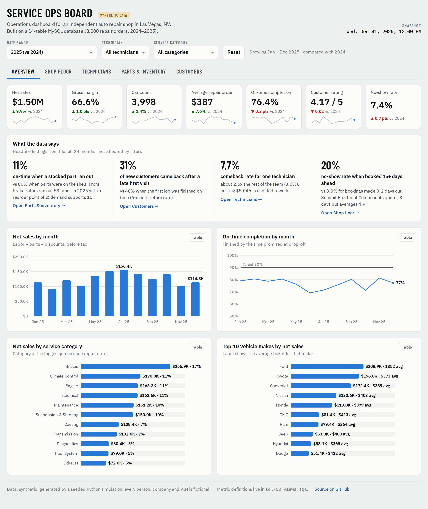
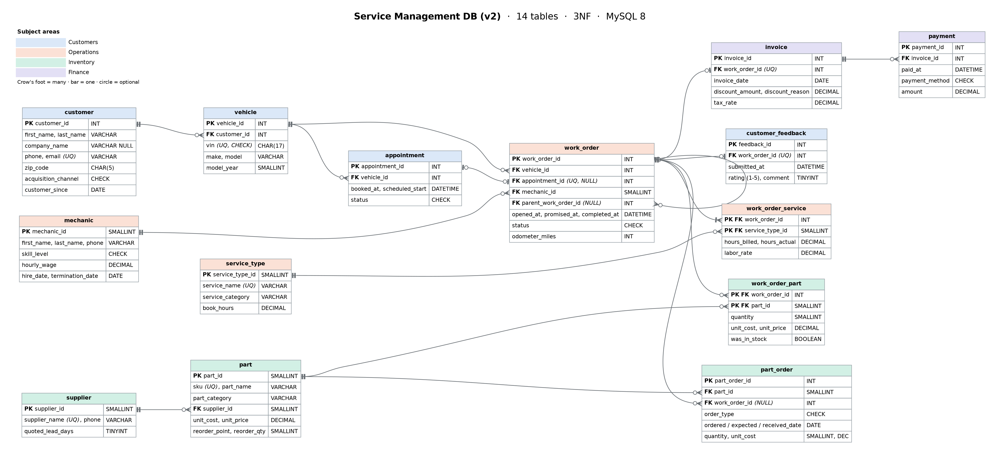

# Service Management Database

**A MySQL database, SQL analysis and operations dashboard for an independent auto repair shop.**
Rebuilt in 2026 from my 2021 UNLV Information Systems capstone.

**[Live dashboard](https://jomelcapili.github.io/Database-Design-and-Implementation/)** ·
**[Full report (PDF)](report/Database_Report_v2.pdf)** ·
**[What I fixed from 2021](docs/FIX_LOG.md)** ·
[Power BI guide](dashboard/POWER_BI_GUIDE.md) ·
[Tableau guide](dashboard/TABLEAU_GUIDE.md)



| 14 tables (3NF) | ~70,000 rows | 22 business questions in SQL | 20 data-quality tests | 5-page dashboard |
|---|---|---|---|---|

> **Data note:** all data is synthetic, generated by a seeded Python simulation of two years of shop operations
> (`python/generate_data.py`). Every person, company, phone number and VIN is fictional.

---

## The story

In 2021 I designed a service-management database for an auto repair shop. The shop's problems were
**jobs and appointments running late** and **no tracking of which parts were used**, which caused stockouts.

In 2026 I re-ran that script on a clean MySQL 8 server. It threw **18 errors**, and several queries that did run
returned **wrong answers with no warning**: an `AND`/`OR` precedence bug, a join that double-counted revenue,
and a "most used parts" query that counted rows instead of units. The deeper problem was the design itself:
parts were linked to *mechanics* instead of *jobs*, so the database couldn't answer the very question it was built for.
([Full audit with evidence](docs/FIX_LOG.md))

So I rebuilt it end to end:

1. **Designed** a normalized 14-table schema with foreign keys and 30 CHECK constraints ([ERD](#database-design))
2. **Simulated** two years of realistic operations in Python (~70K rows) so the design is tested at scale
3. **Built** a reporting layer of 7 SQL views that define every metric once
4. **Answered** 22 business questions with CTEs and window functions
5. **Tested** the data with 20 automated quality checks, which caught a real bug in my own generator
6. **Delivered** an interactive dashboard, a 22-page report, and Power BI / Tableau build kits

## What the data shows

| Finding | Evidence | Recommendation |
|---|---|---|
| **Stockouts are the #1 fixable cause of late jobs** | Jobs where a stocked part ran out were on time **11%** of the time vs. **80%** otherwise. Brake rotors ran out 53 times in 2025 with a reorder point of 2. | Reset reorder points with a lead-time + safety-stock formula: 11 parts, **~$3,570** of added stock |
| **Late first visits lose customers** | New customers came back within 6 months **30.8%** of the time after a late first visit vs. **47.9%** after an on-time one (~76 customers, ~$29K) | Build supplier ETAs into promise times; text customers when a job will be late |
| **One technician drove a disproportionate share of comebacks** | 7.7% comeback rate, 2.6× the team; $5,046 in unbilled rework | Add comeback rate to technician reviews |
| **Long-lead bookings no-show** | 19.7% no-show when booked 15+ days out vs. 3.0% at 0–2 days | Reminder texts for bookings 8+ days out |
| **Growth came from ticket size, not traffic** | 2025 net sales +9.9%, average repair order +7.6%, car count +1.4% | Referral program: referral customers repeat 57% of the time vs. 38% from social |

## Database design



Design decisions worth calling out:

- **3NF with derived totals.** Invoice totals, stock on hand and profit are calculated in views, never stored, so they can't drift from the line items.
- **Price snapshots on transaction lines.** A catalog price change never rewrites an old invoice.
- **Self-referencing foreign key.** A warranty comeback points to the original job, so rework cost traces back to the technician.
- **Every rule enforced.** Foreign keys, UNIQUEs, and CHECK constraints (including a VIN pattern with `REGEXP_LIKE`) block bad data at insert time.

## SQL highlights

| Technique | Example |
|---|---|
| CTEs + window functions (`LAG`, `LEAD`, `ROW_NUMBER`, `RANK`, `NTILE`) | Month-over-month and YoY growth, customer's first vs. next visit, RFM segmentation |
| Recursive CTE | Business-day calendar for demand variability; VIN check-digit validation |
| Statistics in SQL | Reorder point = avg daily use × lead time + 1.65 × σ × √lead time |
| Conditional aggregation | Cohort retention matrix, 12-month seasonality pivot |
| Self-join | Warranty rework → original job → technician |
| Running totals | Inventory ledger that proves stock never goes negative |
| Transactions | Safe UPDATE/DELETE patterns that roll themselves back |

```sql
-- Q16: Does a late first visit cost us the customer?
WITH ranked AS (
    SELECT customer_id, opened_at, is_on_time,
           ROW_NUMBER() OVER (PARTITION BY customer_id ORDER BY opened_at)  AS visit_no,
           LEAD(opened_at) OVER (PARTITION BY customer_id ORDER BY opened_at) AS next_visit_at
    FROM v_work_order_summary
    WHERE job_type = 'Customer Pay'
)
SELECT CASE WHEN is_on_time = 1 THEN 'Finished on time' ELSE 'Finished late' END AS first_visit,
       COUNT(*) AS customers,
       ROUND(AVG(next_visit_at IS NOT NULL
                 AND next_visit_at <= opened_at + INTERVAL 180 DAY) * 100, 1) AS returned_within_180d_pct
FROM ranked
WHERE visit_no = 1 AND opened_at < '2025-07-01'     -- everyone has had 6 months to return
GROUP BY is_on_time;
```
<sub>Simplified. The full query (with cohort filters) is Q16 in `sql/04_analysis_queries.sql`.</sub>

## Repository

```
sql/
  01_schema.sql                 14 tables, keys, CHECK constraints, indexes
  02_seed_data.sql              ~70K rows (generated; do not edit)
  03_views.sql                  7 reporting views: one definition of every metric
  04_analysis_queries.sql       22 business questions
  05_data_quality_checks.sql    20 PASS/FAIL tests
  06_maintenance_examples.sql   safe UPDATE/DELETE patterns (roll themselves back)
python/
  generate_data.py              seeded simulation of shop operations (standard library only)
  export_bi_data.py             views -> CSV + Excel for Power BI / Tableau
  build_dashboard.py            database -> docs/index.html
dashboard/
  dashboard.html                dashboard source (vanilla JS + SVG, no libraries)
  POWER_BI_GUIDE.md, measures.dax, powerbi_theme.json
  TABLEAU_GUIDE.md
data/
  raw/*.csv                     every table as CSV
  bi/ServiceOps_Dashboard_Data.xlsx   analysis-ready workbook with a data dictionary sheet
docs/
  index.html                    the live dashboard (GitHub Pages)
  FIX_LOG.md                    audit of the 2021 version
  erd.dot, img/                 ERD source and images
report/
  Database_Report_v2.pdf        the full report
  report_template.html, build_report.py, capture_images.js, print_pdf.js
legacy/
  service_management_2021.sql, Database_Report_2021.pdf   the original, kept for comparison
```

## Run it

```bash
# MySQL 8.0+  (about 10 seconds)
mysql -u root -p < sql/01_schema.sql
mysql -u root -p < sql/02_seed_data.sql
mysql -u root -p < sql/03_views.sql

mysql -u root -p -t < sql/04_analysis_queries.sql
mysql -u root -p -t < sql/05_data_quality_checks.sql     # expect 20 x PASS
```

MySQL Workbench: open each file with *File → Open SQL Script* and run it in the order above.
To regenerate the data or rebuild the dashboard, see *Appendix C* of the report.

---

**Jomel Capili** · B.S. Business Administration, Information Systems, University of Nevada, Las Vegas ·
[LinkedIn](https://www.linkedin.com/in/jomelcapili)
