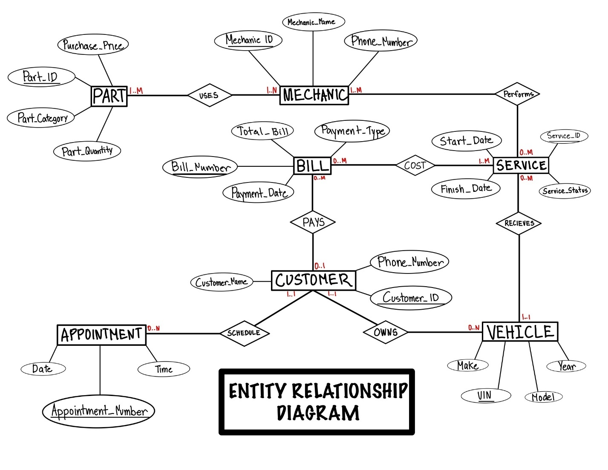
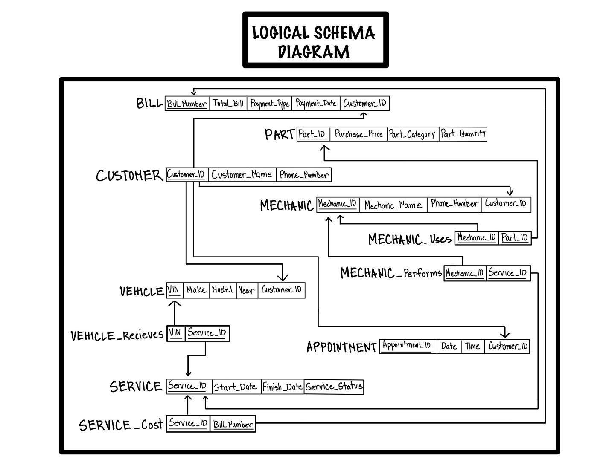

# The original 2021 project

These are the files from my term project for **IS 475, Database Design and Implementation** (UNLV, Fall 2021),
kept so the 2026 rebuild can be compared with where it started. The course asked for at least 7 tables,
50 rows per table, 15 queries, and UPDATE/DELETE examples for every table.

| File | What it is |
|---|---|
| [`Project_Proposal_2021.pdf`](Project_Proposal_2021.pdf) | The written proposal: business problem, data requirements, business value |
| [`Project_Proposal_Slides_2021.pdf`](Project_Proposal_Slides_2021.pdf) | The proposal presentation slides |
| [`Project_Report_2021.pdf`](Project_Report_2021.pdf) | The final report as submitted on December 1, 2021: business rules, ERD, logical schema, data dictionary, 15 queries with screenshots |
| [`service_management_2021.sql`](service_management_2021.sql) | The SQL script: 11 tables, 550 rows typed by hand, 15 queries, UPDATE/DELETE examples |
| [`img/erd_2021.jpg`](img/erd_2021.jpg), [`img/logical_schema_2021.jpg`](img/logical_schema_2021.jpg) | The hand-drawn diagrams from the report |

The report is exactly as submitted. The proposal and slides were exported to PDF from the original Word
and PowerPoint files so they can be read on GitHub. The SQL script is the version I last touched in 2024,
when I renamed the database, moved one table definition, and added a column to one `GROUP BY`; the rest
is as written in 2021.

## The two diagrams

| Conceptual ERD (2021) | Logical schema (2021) |
|---|---|
|  |  |

## What happened to it

I built and ran this in MySQL Workbench on Windows in 2021, and it worked: every table, insert, query and
update runs, and only the DELETE examples at the end are blocked (mostly by foreign keys protecting
related rows). When I revisited it in 2026, I found queries that ran cleanly but returned wrong answers,
a design that couldn't show which parts went into which job, and a table-name capitalization
inconsistency that breaks 12 statements on a Linux server. [`docs/FIX_LOG.md`](../docs/FIX_LOG.md) covers
every item, including the ten design issues my professor flagged when it was graded, and how version 2
fixes each one.
